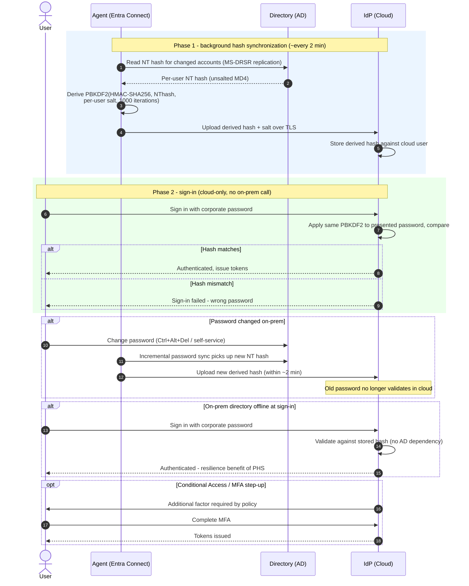

# Password Hash Sync — Sequence Diagram

Two phases: the background hash synchronization, then a cloud-only sign-in. Alternates cover
on-prem password change, on-prem outage, and MFA step-up.

Notes

- Password sync is separate from and more frequent than object/attribute sync, so a changed
  password reaches the cloud within a couple of minutes.
- The uploaded value is a salted PBKDF2 over the NT hash — it cannot be reversed to the
  password nor replayed as the NT hash on-prem.
- Phase 2 never contacts the Directory: that independence is the resilience and simplicity
  advantage of PHS over federation and pass-through.
