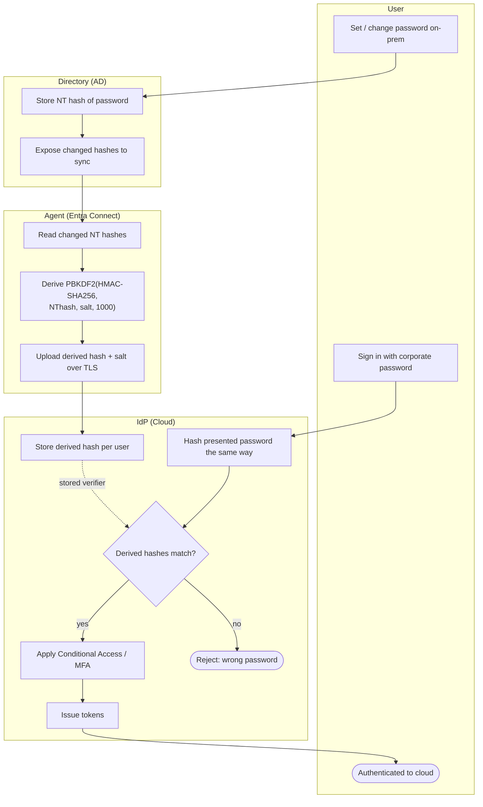

# Password Hash Sync — Swimlane Diagram

One lane per actor. The Agent bridges on-prem and cloud; sign-in stays entirely in the IdP
lane.

Notes

- The Agent lane is the only place the on-prem hash is touched; it emits a salted PBKDF2
  derivation, never the plaintext or the raw NT hash.
- Sign-in flows entirely within the IdP lane against the stored verifier (dashed link),
  which is why an offline Directory does not block cloud sign-in.
- Conditional Access and MFA (`I4`) layer on top of the password check, not instead of it.
