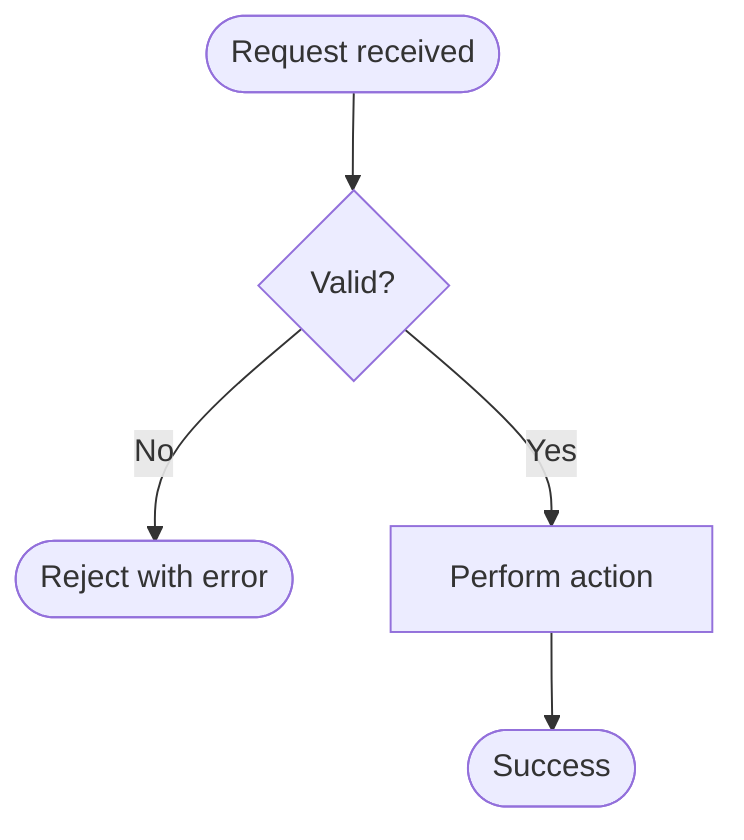

# Diagram Title — Decision Flowchart

Decision logic with explicit deny/error terminals.

```mermaid
flowchart TD
    Start(["Request received"]) --> Check{"Valid?"}
    Check -->|No| Deny(["Reject with error"])
    Check -->|Yes| Do["Perform action"]
    Do --> Done(["Success"])
```
