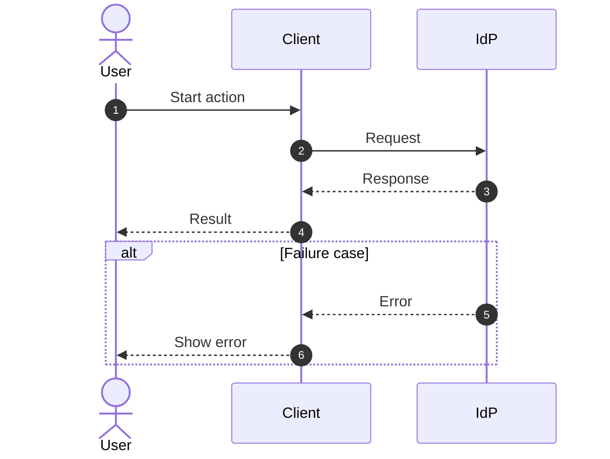

# Diagram Title — Sequence Diagram

Happy path first, then `alt` / `opt` blocks for alternates and failures.

```mermaid
sequenceDiagram
    autonumber
    actor User
    participant Client
    participant IdP

    User->>Client: Start action
    Client->>IdP: Request
    IdP-->>Client: Response
    Client-->>User: Result

    alt Failure case
        IdP-->>Client: Error
        Client-->>User: Show error
    end
```
