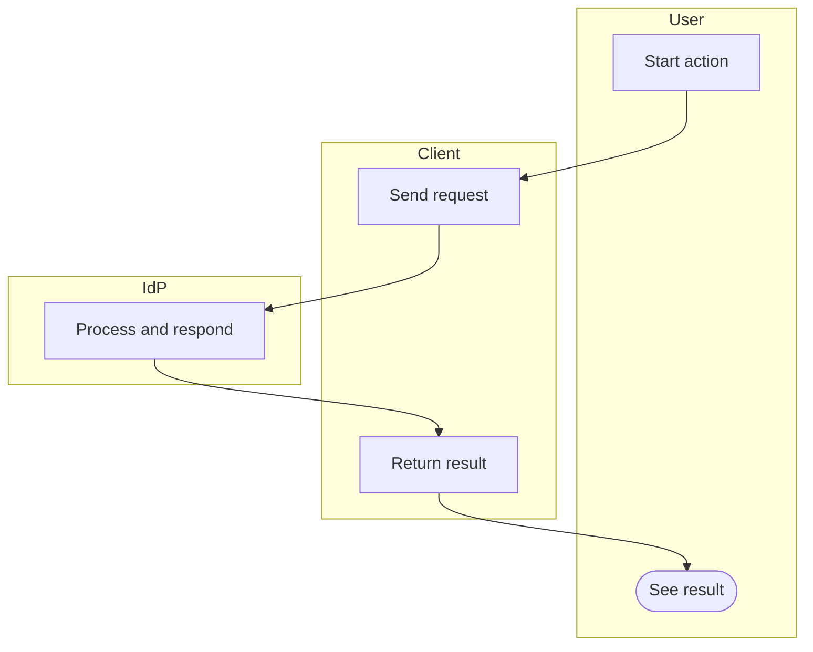

# Diagram Title — Swimlane Diagram

One `subgraph` lane per actor. Arrows crossing lanes are handoffs.

```mermaid
flowchart TD
    subgraph User
        U1["Start action"]
        U2(["See result"])
    end
    subgraph Client
        C1["Send request"]
        C2["Return result"]
    end
    subgraph IdP
        I1["Process and respond"]
    end
    U1 --> C1 --> I1 --> C2 --> U2
```
