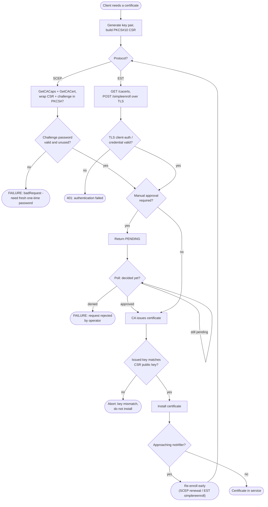

# Certificate Enrollment (SCEP / EST) — Decision Flowchart

Protocol selection, capability/CA-cert discovery, challenge or client-auth validation,
pending-approval polling, and issuance, with explicit failure terminals.

