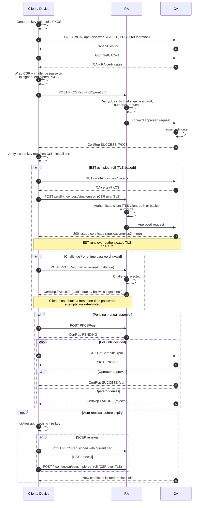

# Certificate Enrollment (SCEP / EST) — Sequence Diagram

Happy path shown for **SCEP**: capability discovery, CA cert retrieval, then a
challenge-authorized `PKCSReq`. Alternates: the **EST `/simpleenroll`** equivalent,
invalid challenge, pending manual approval with polling, and auto-renewal before expiry.

