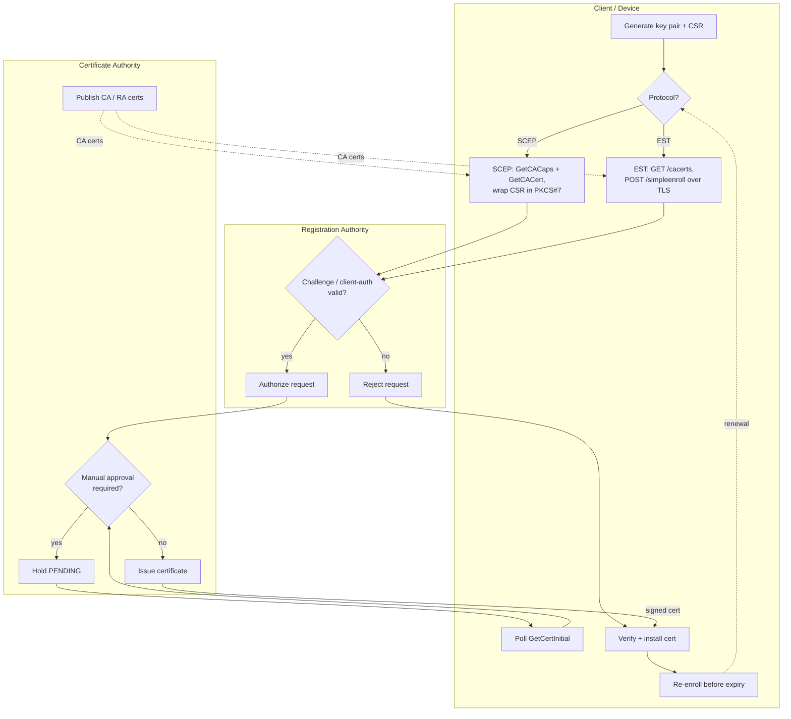

# Certificate Enrollment (SCEP / EST) — Swimlane

Lanes for Client/Device, RA (Registration Authority), and CA. The client generates the
key and CSR; the RA authorizes; the CA issues.

```mermaid
flowchart TD
    subgraph Client["Client / Device"]
        C1["Generate key pair + CSR"]
        C2{"Protocol?"}
        C3["SCEP: GetCACaps + GetCACert,<br/>wrap CSR in PKCS#7"]
        C4["EST: GET /cacerts,<br/>POST /simpleenroll over TLS"]
        C5["Poll GetCertInitial"]
        C6["Verify + install cert"]
        C7["Re-enroll before expiry"]
    end

    subgraph RA["Registration Authority"]
        R1{"Challenge / client-auth<br/>valid?"}
        R2["Authorize request"]
        R3["Reject request"]
    end

    subgraph CA["Certificate Authority"]
        A1{"Manual approval<br/>required?"}
        A2["Issue certificate"]
        A3["Hold PENDING"]
        A4["Publish CA / RA certs"]
    end

    C1 --> C2
    C2 -->|SCEP| C3 --> R1
    C2 -->|EST| C4 --> R1
    A4 -.->|CA certs| C3
    A4 -.->|CA certs| C4
    R1 -->|no| R3 --> C6
    R1 -->|yes| R2 --> A1
    A1 -->|no| A2 -->|signed cert| C6
    A1 -->|yes| A3 --> C5 --> A1
    C6 --> C7 -.->|renewal| C2
```
