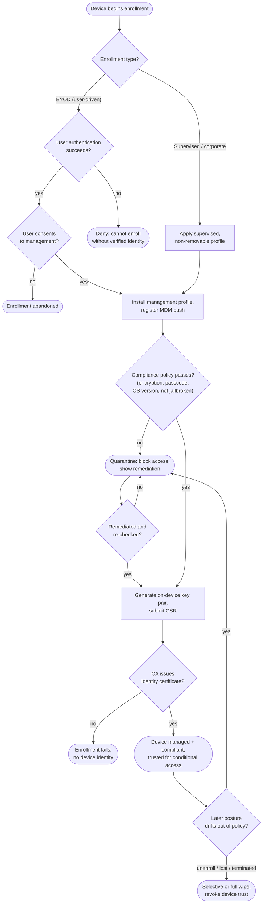

# Device Enrollment (MDM) — Decision Flowchart

Decision logic from enrollment type through user authentication, profile install,
compliance evaluation, and identity-certificate issuance, with quarantine and wipe
terminals.

