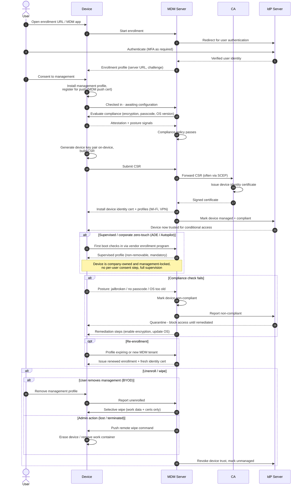

# Device Enrollment (MDM) — Sequence Diagram

Happy path: user authenticates, MDM issues an enrollment profile, the device installs the
management profile (with push cert), compliance is evaluated, and a device identity
certificate is issued. Alternates: supervised/corporate zero-touch enrollment, compliance
failure and quarantine, re-enrollment, and unenroll/wipe.

