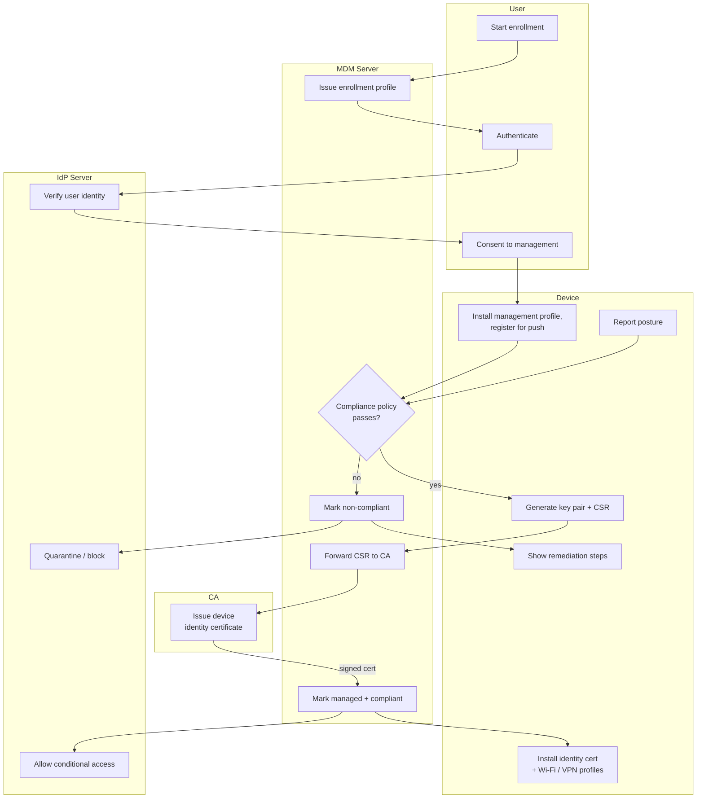

# Device Enrollment (MDM) — Swimlane

Lanes for User, Device, MDM Server, CA, and IdP Server. The device generates its own key
pair and installs profiles; the MDM orchestrates policy and the CA issues the identity
certificate.

