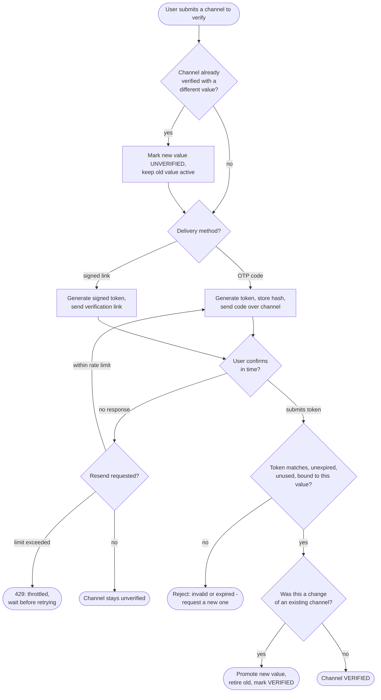

# Email / Phone Verification — Decision Flowchart

Decision logic for issuing and validating a verification token, including link vs OTP,
expiry, rate limiting, and re-verification of a changed channel.

