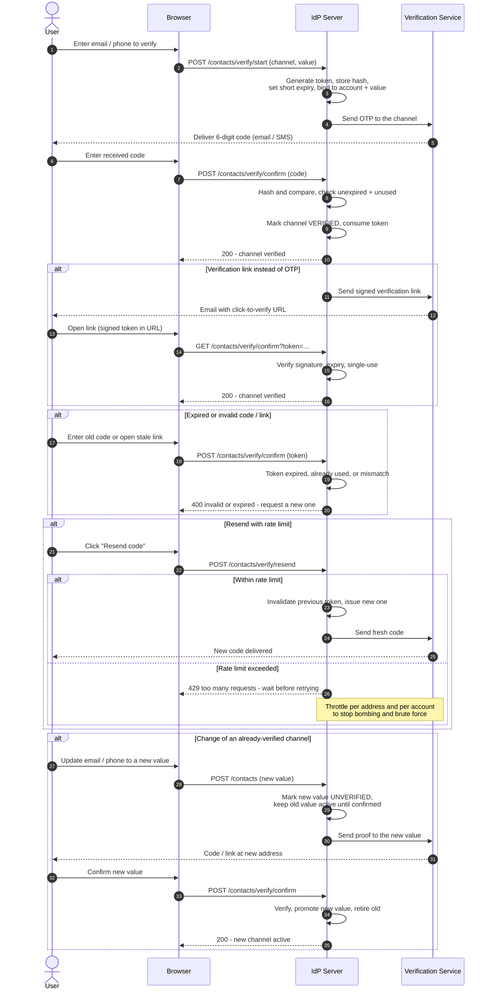

# Email / Phone Verification — Sequence Diagram

Happy path: the server issues a proof, delivers it over the channel, and marks the
channel verified once the user confirms. Alternates: verification link vs OTP code,
expired/invalid token, resend with rate limiting, and changing an already-verified
channel.

