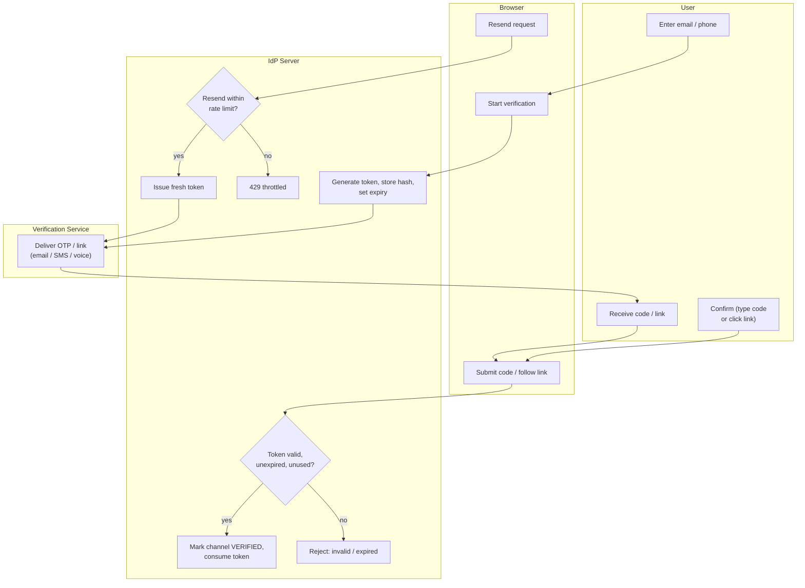

# Email / Phone Verification — Swimlane

Lanes for User, Browser, IdP Server, and Verification Service. The IdP owns the token
lifecycle; the Verification Service only delivers the proof out of band.

