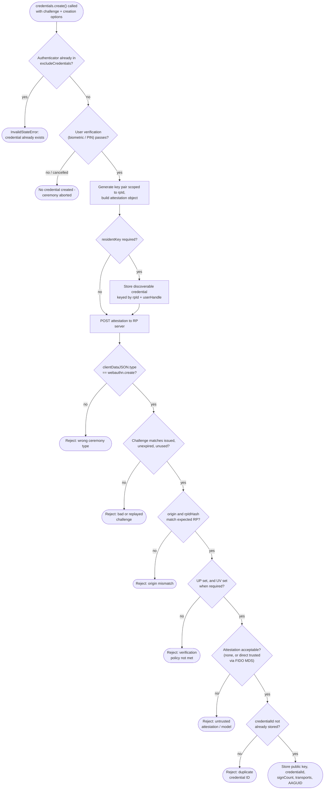

# FIDO2 / Passkey Registration — Decision Flowchart

Client-side branching (attachment, exclude list, user verification) followed by the
server-side attestation validation pipeline, with explicit rejection terminals.

