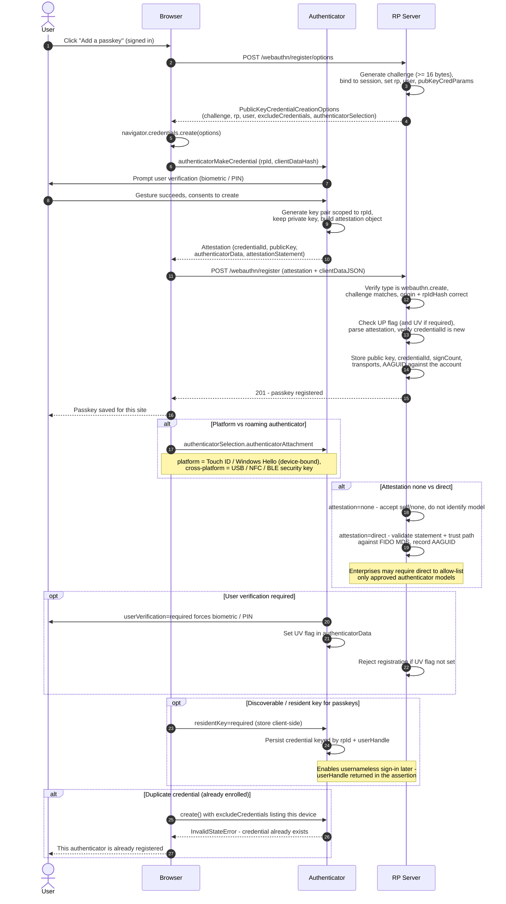

# FIDO2 / Passkey Registration — Sequence Diagram

Happy path: the RP issues creation options with a challenge, the browser calls
`navigator.credentials.create()`, the authenticator generates a key pair and returns an
attestation object, and the server verifies it and stores the public key. Alternates:
platform vs roaming authenticator, attestation `none` vs `direct`, user verification
required, discoverable/resident key, and duplicate credential.

