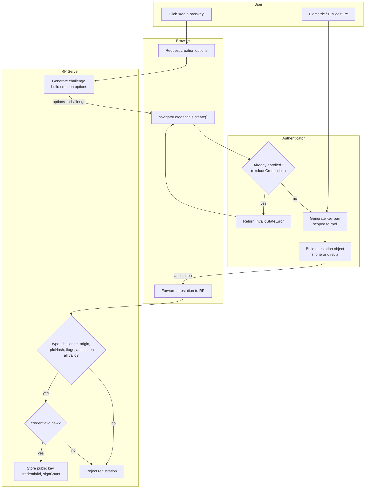

# FIDO2 / Passkey Registration — Swimlane

Lanes for User, Browser, Authenticator, and RP Server. The key pair is generated inside
the authenticator; only the public key and credential ID cross to the server.

