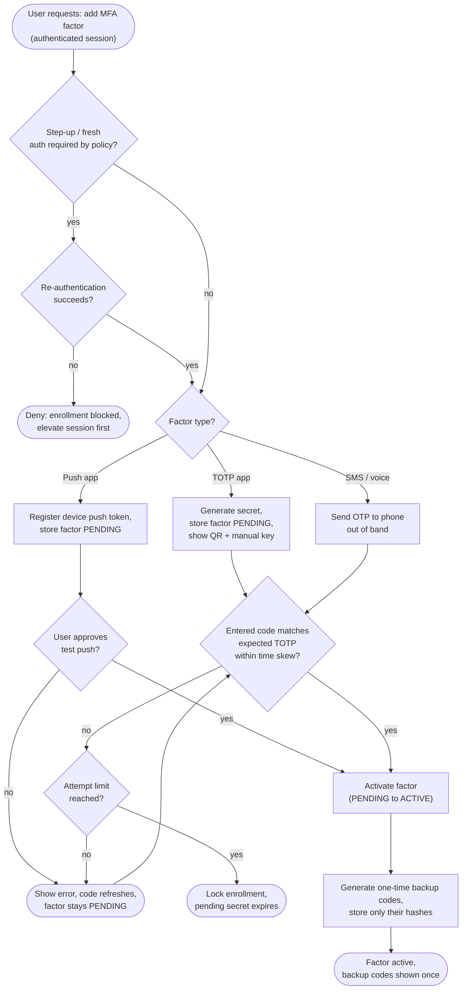
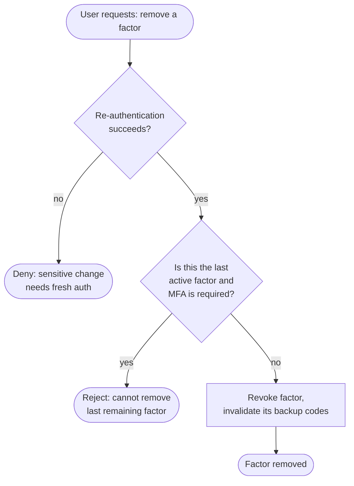

# MFA Enrollment — Decision Flowchart

Decision logic from the enrollment request through the step-up gate, secret
provisioning, proof-of-possession, and activation, with explicit error terminals.

## Removing or replacing a factor

