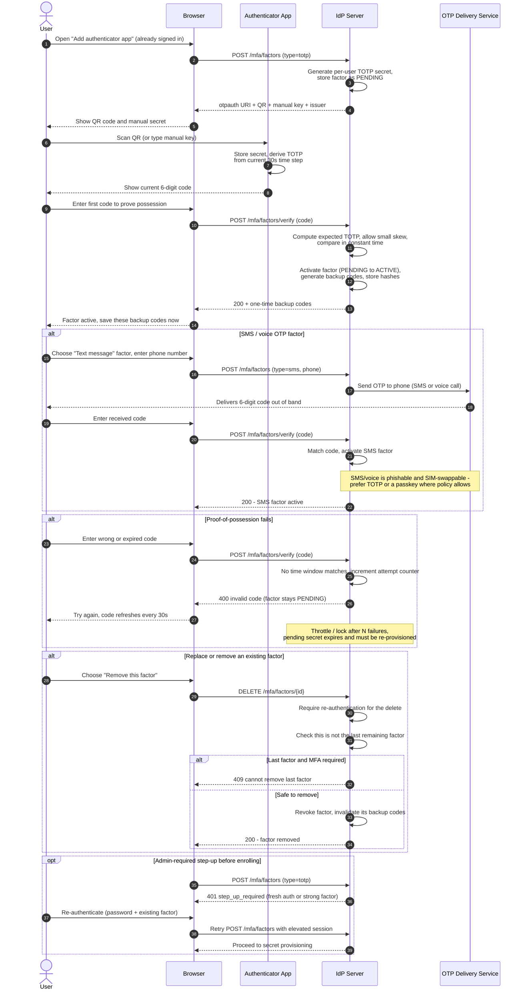

# MFA Enrollment — Sequence Diagram

Happy path: an authenticated user adds a TOTP authenticator — secret provisioning via
QR, proof-of-possession with the first code, backup codes issued. Alternates: SMS/voice
OTP factor, proof-of-possession failure, replacing/removing a factor, and an
admin-required step-up before enrollment.

