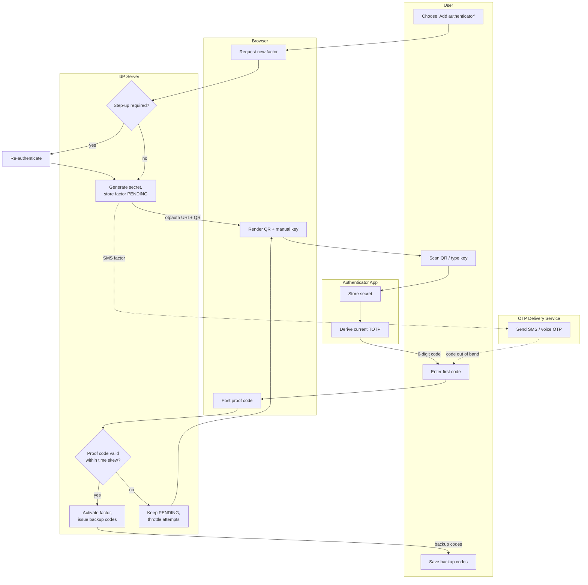

# MFA Enrollment — Swimlane

Lanes for each actor: the User drives the UI, the Browser renders the QR and posts the
proof, the Authenticator holds the secret, the IdP Server owns provisioning and
activation, and the OTP Delivery Service handles the SMS/voice alternate.

