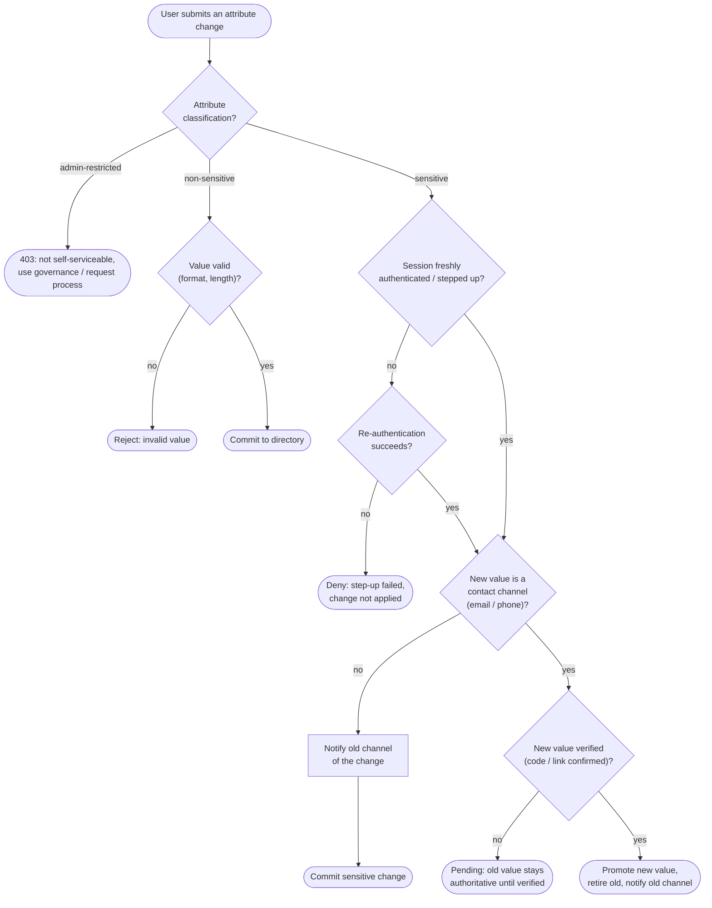

# Profile Attribute Update — Decision Flowchart

Server-side attribute classification drives the gate: immediate commit, step-up plus
optional re-verification, or outright rejection. Explicit terminals for each outcome.

