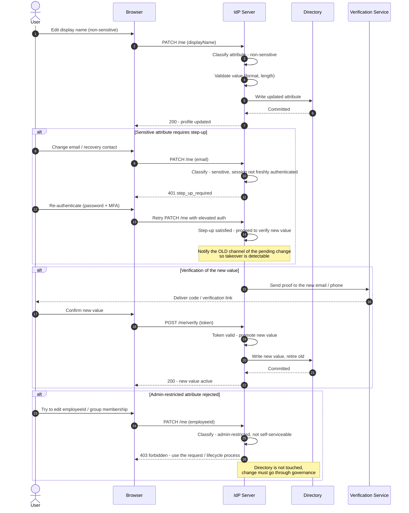

# Profile Attribute Update — Sequence Diagram

Happy path shows a non-sensitive attribute committing immediately. Alternates: a sensitive
attribute requiring step-up re-authentication, re-verification of a new contact value, and
rejection of an admin-restricted attribute.

