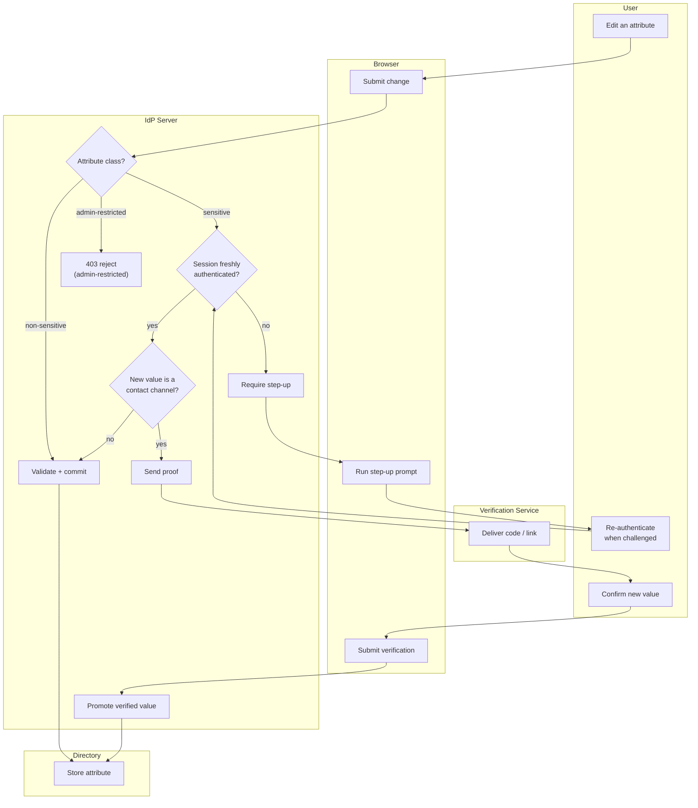

# Profile Attribute Update — Swimlane

Lanes for User, Browser, IdP Server, Directory, and Verification Service. The IdP
classifies the attribute and decides which gate applies before anything reaches the
Directory.

