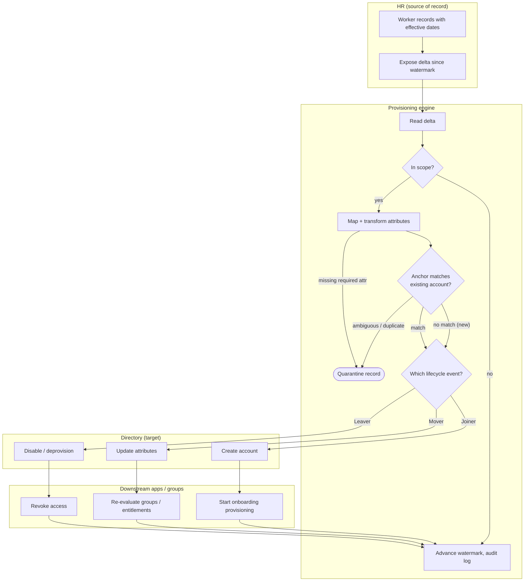

# HR-Driven Inbound Provisioning — Swimlane Diagram

One lane per actor. HR authoritatively supplies records; the Provisioning lane decides the
lifecycle action; the Directory and Downstream lanes carry it out.

Notes

- The `P2` scope gate and `P4` match gate together decide whether a record becomes a Joiner
  (no match), a Mover/Leaver (match), or nothing (out of scope).
- Every successful action loops back to `P6` to advance the watermark and write the audit
  entry, so the next run only sees new HR changes.
- Records that fail mapping or match ambiguously divert to the `PQ` quarantine terminal
  instead of writing to the Directory — see [flowchart.md](./flowchart.md).
