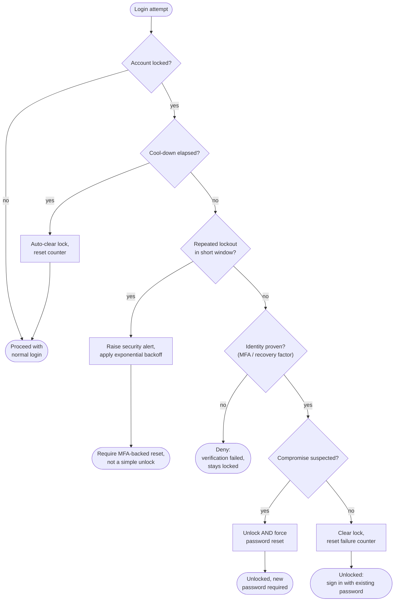

# Account Unlock — Decision Flowchart

Branch-focused view: detect lockout, auto-unlock after cool-down, identity proof for
manual unlock, repeated-lockout escalation, and the unlock-vs-reset decision.

