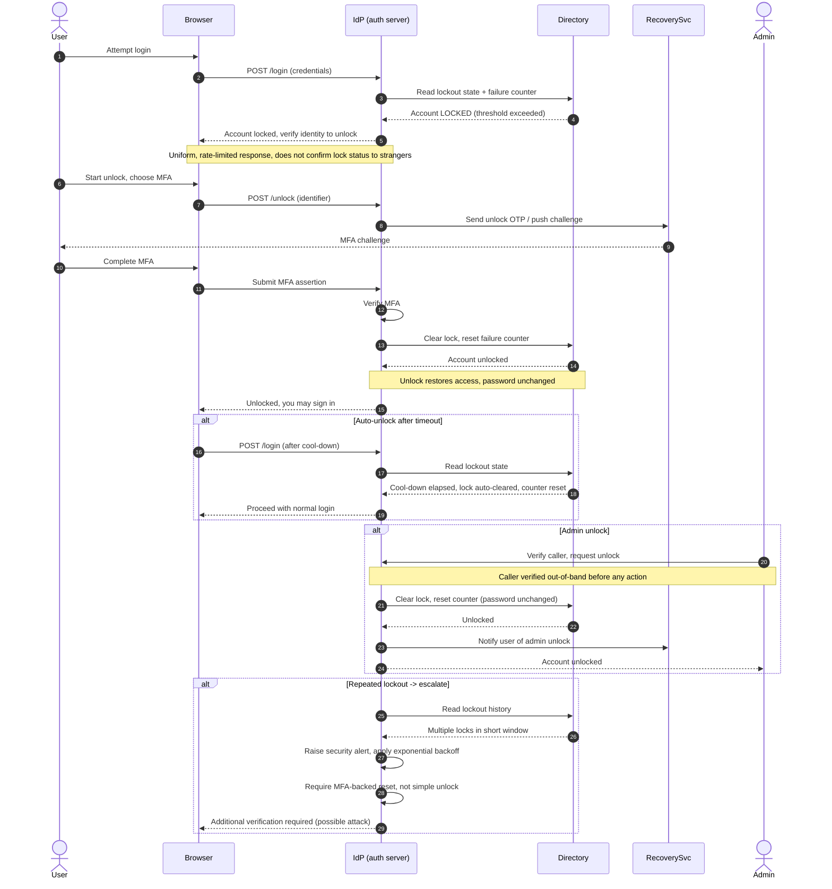

# Account Unlock — Sequence Diagram

Happy path: a locked-out user proves identity with MFA, the account is unlocked, and
the failure counter is reset — no password change required. Alternates: auto-unlock
after a cool-down timeout, admin unlock after caller verification, and repeated
lockout that escalates to a security alert.

