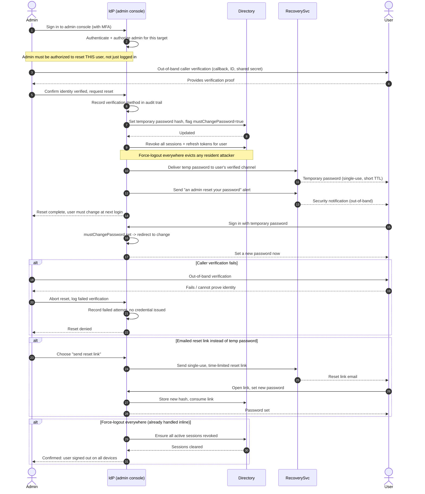

# Admin-Initiated Password Reset — Sequence Diagram

Happy path: admin authenticates, verifies the caller out-of-band, issues a
temporary password, forces change at next login, notifies and audits. Alternates:
caller verification fails, emailed reset link instead of a temp password, and
force-logout everywhere.

