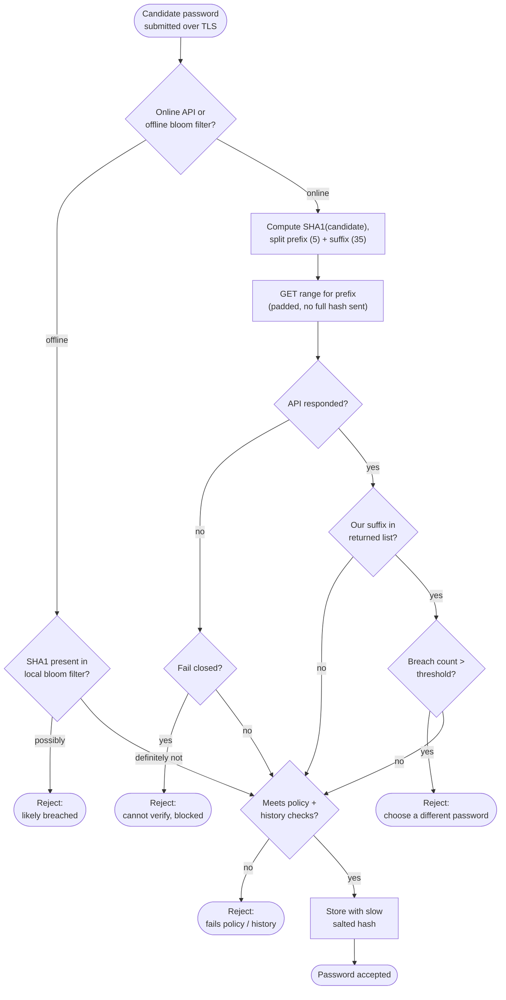

# Breached Password Detection — Decision Flowchart

Branch-focused view: the k-anonymity range query, local suffix match, the
breach-count threshold decision, API-failure handling, and the offline
bloom-filter alternative.

