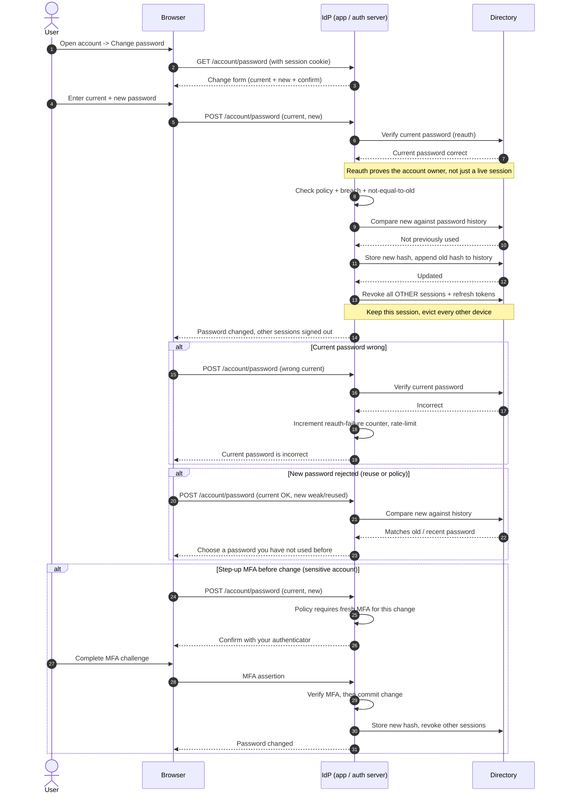

# Authenticated Password Change — Sequence Diagram

Happy path: a logged-in user reauthenticates with the current password, the new
password passes policy/history/breach checks, the hash is updated, and other
sessions are revoked. Alternates: wrong current password, new password rejected
by history/policy, and a step-up MFA requirement.

