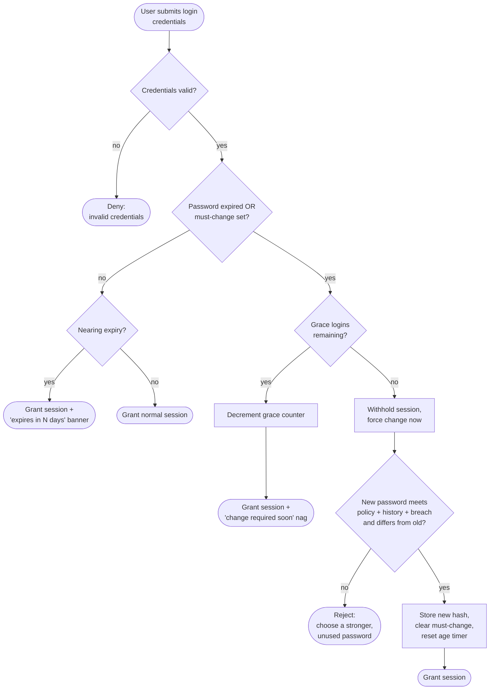

# Password Expiry and Rotation — Decision Flowchart

Branch-focused view: after a valid login, decide whether the password is expired or
flagged must-change, whether grace logins remain, whether to warn or force, and
validate the replacement password before granting a session.

