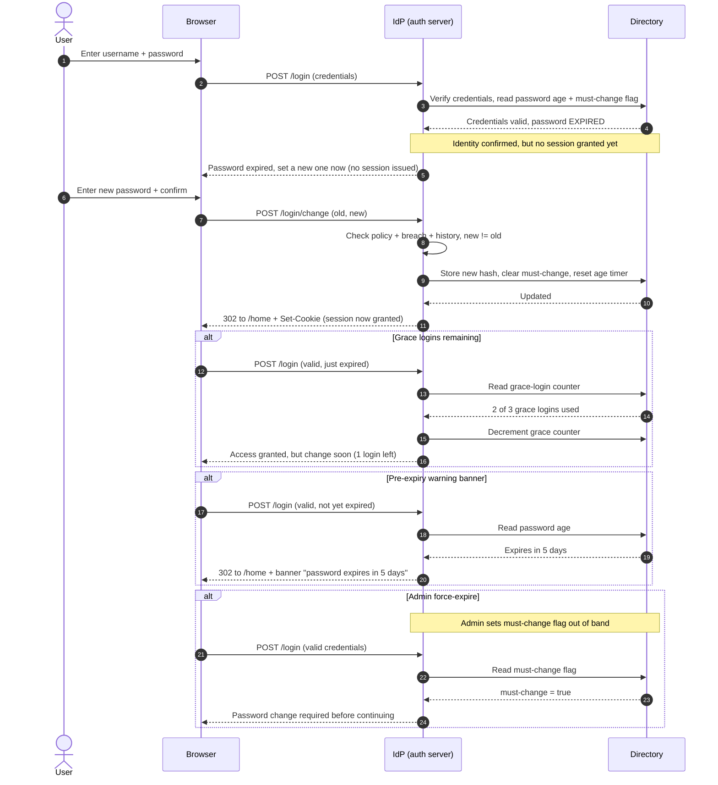

# Password Expiry and Rotation — Sequence Diagram

Happy path: the user logs in, the IdP detects an expired / must-change credential,
withholds the session, forces a compliant new password, then grants access.
Alternates: grace logins remaining, pre-expiry warning banner, and admin
force-expire.

