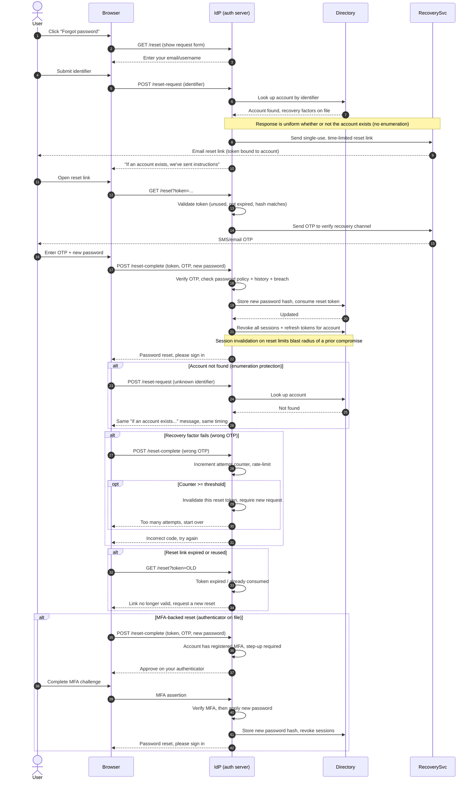

# Self-Service Password Reset — Sequence Diagram

Happy path: request reset, receive an emailed link, verify a recovery OTP, set a
policy-compliant new password, and invalidate all old sessions. Alternates:
account-enumeration protection, wrong OTP with rate limiting, expired reset link,
and an MFA-backed reset.

