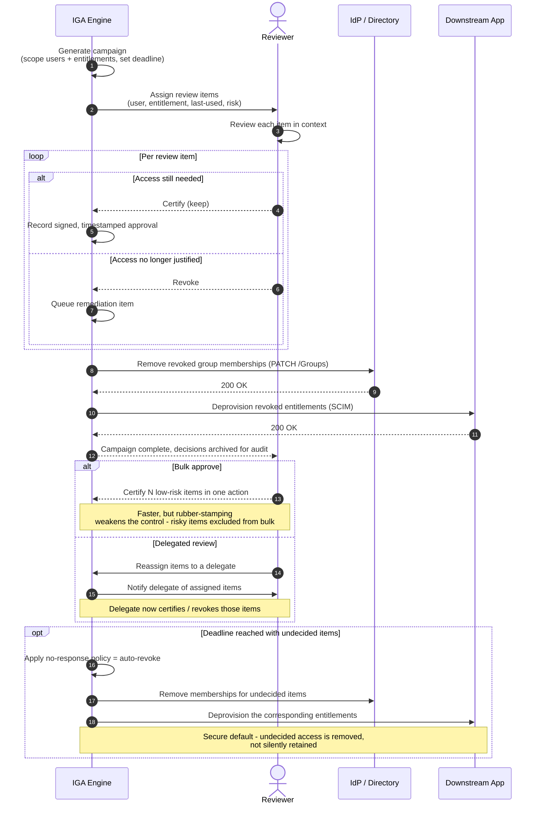

# Access Review & Certification — Sequence Diagram

Happy path first (campaign generated, reviewer decides per item, revocations remediated),
then bulk-approve, delegated-review, and auto-revoke-on-no-response alternates.

Notes

- Each decision is stored with reviewer identity and timestamp — that record *is* the audit
  evidence the campaign exists to produce.
- Auto-revoke on no-response is deliberate: the safe default for an unattested grant is to
  remove it, shifting the burden onto keeping access rather than losing it.

Related: [README](./README.md) | [Swimlane](./swimlane.md) | [Flowchart](./flowchart.md)
