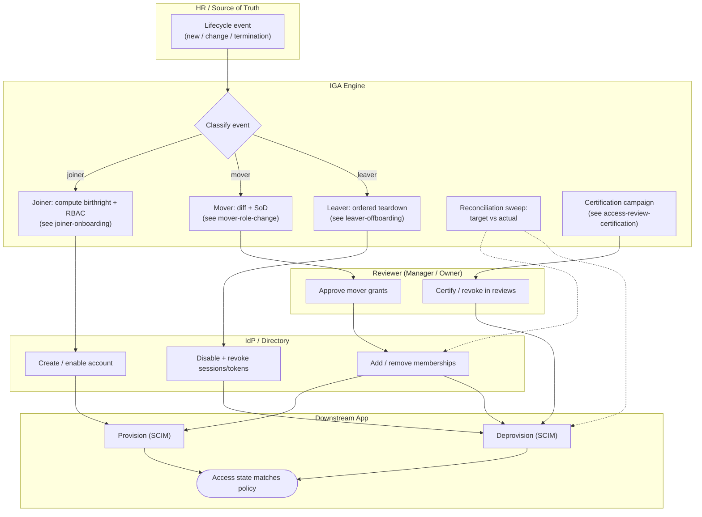

# JML Orchestration — Swimlane Diagram

One lane per actor across the whole lifecycle. The IGA lane is the hub that classifies each
HR event and routes it to the joiner, mover, or leaver handling, all landing in the shared
IdP and app lanes.

Related: [README](./README.md) | [Sequence](./sequence.md) | [Flowchart](./flowchart.md)
