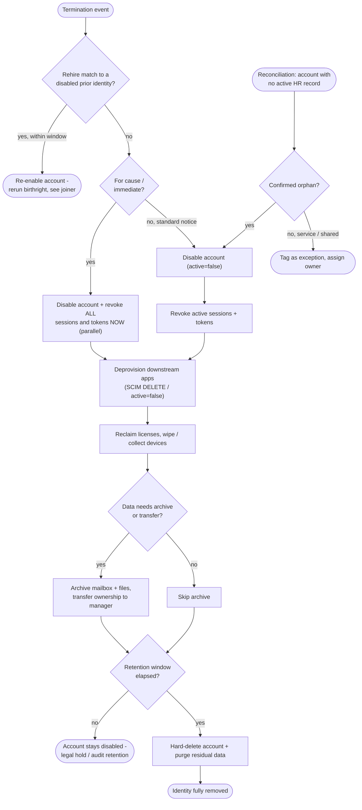

# Leaver — Offboarding Decision Flowchart

Teardown decision logic with the for-cause fast path, the rehire branch, and the retention
gate before deletion.

Notes

- The for-cause branch collapses disable and revoke into one immediate parallel action;
  the standard path does them in sequence but still before any app cleanup.
- Deletion never happens on the termination event itself — the retention gate defers it,
  and legal hold can pin the account indefinitely.

Related: [README](./README.md) | [Sequence](./sequence.md) | [Swimlane](./swimlane.md)
