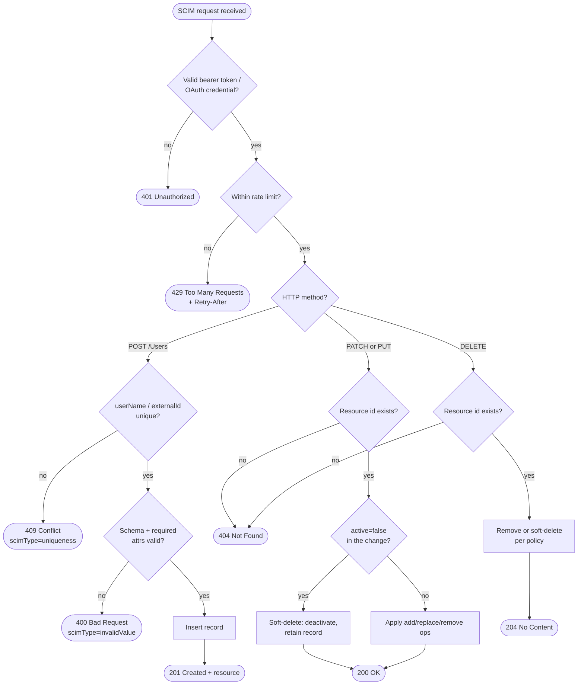

# SCIM 2.0 Provisioning — Decision Flowchart

Service-provider-side request-handling logic, with explicit error terminals for auth
failure, uniqueness conflict, rate limiting, and not-found.

Notes

- `409 uniqueness` is a routine control-flow signal to the client (switch to update), not a
  terminal failure — but on the server side it is still a distinct response.
- Whether `DELETE` hard-removes or maps to `active=false` is an SP policy choice; leaver
  flows under retention prefer the soft-delete mapping.

Related: [README](./README.md) | [Sequence](./sequence.md) | [Swimlane](./swimlane.md)
