# Enterprise Identity Environment — Systems Architecture

A high-level map of the systems in a representative enterprise identity environment and how
they relate. Product names (SailPoint, Okta, Microsoft Entra ID, Active Directory, Workday,
CyberArk) are **illustrative** — swap in your own IGA, IdP, directory, HR, and PAM. Edges are
labelled by **function** (what flows between systems); see [`network-security.md`](network-security.md)
for the same environment annotated with **ports and protocols**.

```mermaid
flowchart LR
    subgraph people["People and endpoints"]
        Users(["Workforce users"])
        Devices["Managed endpoints<br/>(laptops, mobile)"]
    end

    subgraph src["Authoritative sources"]
        HR["Workday<br/>(HR system of record)"]
    end

    subgraph gov["Identity governance (IGA)"]
        SailPoint["SailPoint<br/>(joiner/mover/leaver, access<br/>requests, certifications)"]
    end

    subgraph idp["Access management"]
        Okta["Okta<br/>(SSO / IdP, MFA,<br/>adaptive policy)"]
        Entra["Microsoft Entra ID<br/>(cloud IdP, Conditional Access)"]
    end

    subgraph dir["Directories"]
        AD["Active Directory<br/>(on-prem domain)"]
    end

    subgraph pam["Privileged access"]
        CyberArk["CyberArk<br/>(PAM vault, session mgmt)"]
    end

    subgraph apps["Applications"]
        SaaS["SaaS apps<br/>(Salesforce, M365, ...)"]
        OnPrem["On-prem / legacy apps"]
    end

    HR -->|"authoritative identity<br/>joiner / mover / leaver"| SailPoint
    SailPoint -->|"provision / deprovision<br/>accounts + groups"| AD
    SailPoint -->|"lifecycle + entitlements"| Okta
    SailPoint -->|"provision access (SCIM / connectors)"| SaaS
    SailPoint -->|"access certifications"| Users

    AD <-->|"directory sync"| Entra
    Okta <-->|"delegated auth /<br/>directory integration"| AD

    Users --> Devices
    Devices -->|"sign in"| Okta
    Devices -->|"sign in"| Entra
    Okta -->|"MFA / step-up challenge"| Users

    Okta -->|"SSO (SAML / OIDC)"| SaaS
    Entra -->|"SSO (SAML / OIDC)"| SaaS
    Okta -->|"SSO / header or Kerberos"| OnPrem

    CyberArk -->|"vaulted credentials /<br/>privileged sessions"| AD
    CyberArk -->|"privileged sessions"| OnPrem

    classDef person fill:#ede9fe,stroke:#7c3aed,color:#3b0764;
    classDef source fill:#fef3c7,stroke:#b45309,color:#7c2d12;
    classDef govc fill:#dcfce7,stroke:#15803d,color:#14532d;
    classDef idpc fill:#dbeafe,stroke:#1d4ed8,color:#1e3a8a;
    classDef dirc fill:#e0e7ff,stroke:#4338ca,color:#312e81;
    classDef pamc fill:#fee2e2,stroke:#b91c1c,color:#7f1d1d;
    classDef appc fill:#f1f5f9,stroke:#475569,color:#0f172a;
    class Users,Devices person;
    class HR source;
    class SailPoint govc;
    class Okta,Entra idpc;
    class AD dirc;
    class CyberArk pamc;
    class SaaS,OnPrem appc;
```

Notes

- **Directionality tells the story.** HR is the source of truth; SailPoint (IGA) is the
  control plane that *provisions* into the directory, the IdP, and applications; Okta/Entra are
  the *runtime* that authenticates users and brokers SSO into applications.
- **IGA vs IdP.** SailPoint decides *who should have access* (birthright, requests,
  certifications, SoD); Okta/Entra enforce *authentication and SSO* at run time. Keeping the two
  planes distinct is the core of the design.
- **Directory integration.** Okta authenticates against Active Directory (delegated auth) while
  Entra ID stays in sync with AD; many environments run both an on-prem and a cloud directory
  during migration.
- **Privileged access is separate.** CyberArk brokers administrative access to AD and sensitive
  hosts so privileged credentials are vaulted and sessions are recorded, rather than admins
  holding standing credentials.
- Swap products freely: SailPoint → Saviynt/Omada; Okta → Ping/ForgeRock; Workday → SAP
  SuccessFactors; CyberArk → BeyondTrust/Delinea.
