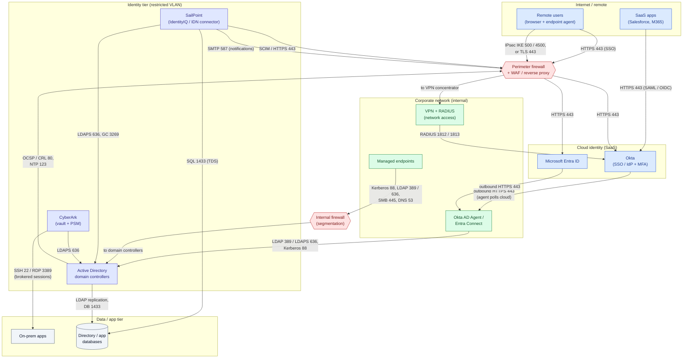

# Enterprise Identity Environment — Network Security View

The same environment as [`flowchart.md`](flowchart.md), re-drawn as **network zones** separated
by firewalls, with every link labelled by the **port and protocol** it uses. Use it to reason
about segmentation and firewall rules. Ports are the common defaults — confirm against your own
build. All hostnames/addresses are illustrative.

## Port / protocol reference

| Link | Port(s) | Protocol / purpose |
|---|---|---|
| Browser → Okta / Entra / SaaS | 443 | HTTPS — SSO (SAML, OIDC/OAuth) |
| Remote access VPN | 500, 4500 (IPsec) or 443 (TLS) | Encrypted tunnel into corp |
| VPN / NAS → Okta | 1812, 1813 | RADIUS auth + accounting (MFA) |
| Okta AD Agent / Entra Connect → cloud | 443 outbound | Agent-initiated, no inbound firewall hole |
| Agent / apps → Active Directory | 389 / 636, 3269, 88, 445, 53 | LDAP / LDAPS, Global Catalog, Kerberos, SMB, DNS |
| SailPoint → AD | 636, 3269 | LDAPS, Global Catalog over TLS |
| SailPoint / AD → database | 1433 | SQL Server (TDS); 5432 for PostgreSQL |
| CyberArk → targets | 22, 3389 | SSH / RDP via brokered (PSM) sessions |
| Notifications | 587 (or 25) | SMTP submission |
| Certificate / time | 80, 123 | OCSP / CRL, NTP |

Notes

- **Agents dial out.** Okta's AD Agent and Entra Connect make **outbound 443** to the cloud, so
  no inbound port needs opening to the identity tier — a key reason cloud IdP integrations are
  firewall-friendly.
- **Segment the identity tier.** Domain controllers, the IGA server, and the PAM vault sit behind
  an internal firewall on a restricted VLAN; only the specific ports above are permitted, and
  privileged protocols (SSH/RDP) reach hosts **only** through CyberArk.
- **Prefer LDAPS (636) over LDAP (389)** and disable anonymous binds; 389 is shown only where
  legacy integrations still require it.
- Pair this with [Network segmentation and DMZ](../../network-security/network-segmentation-dmz/README.md),
  [Zero-trust architecture](../zero-trust-architecture/README.md), and
  [Kerberos exchanges](../../../authentication/kerberos/as-exchange/README.md).
