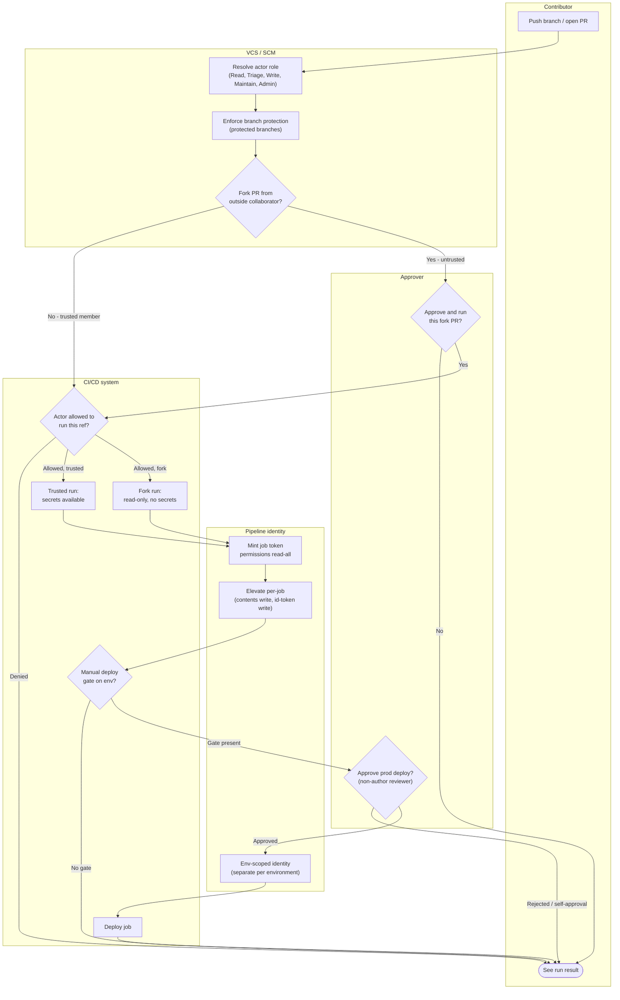

# Pipeline Access Control — Swimlane Diagram

One lane per actor/component. Arrows crossing lanes are handoffs: role resolution at the
SCM, run authorization at the CI system, token minting for the pipeline identity, and the
human approval gate.

Notes

- The SCM lane owns git-side RBAC (roles, protected branches); the CI lane owns CI-side
  authorization (who may run a ref, deployment gates).
- The pipeline-identity lane makes least privilege visible: `read-all` first (`T1`), then
  per-job elevation (`T2`), then a **separate environment-scoped identity** for prod (`T3`).
- Fork PRs are routed to the read-only, no-secrets branch (`K3`) unless a maintainer approves
  the run at `A1`.
- Both approval diamonds are human gates; `A2` additionally forbids self-approval by the
  change author. Full decision detail is in [flowchart.md](./flowchart.md).
