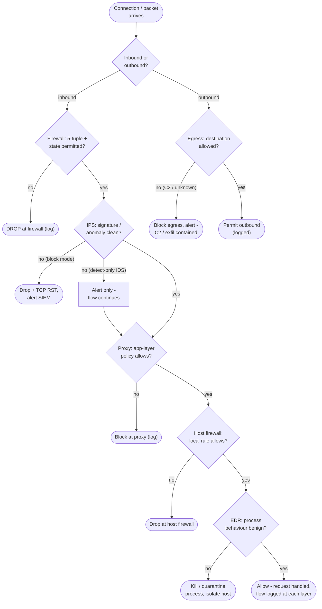

# Defense in Depth — Decision Flowchart

A connection is evaluated layer by layer. Each layer can allow-and-log or deny; the last
gates are on the host itself, and outbound traffic is checked by egress filtering.

