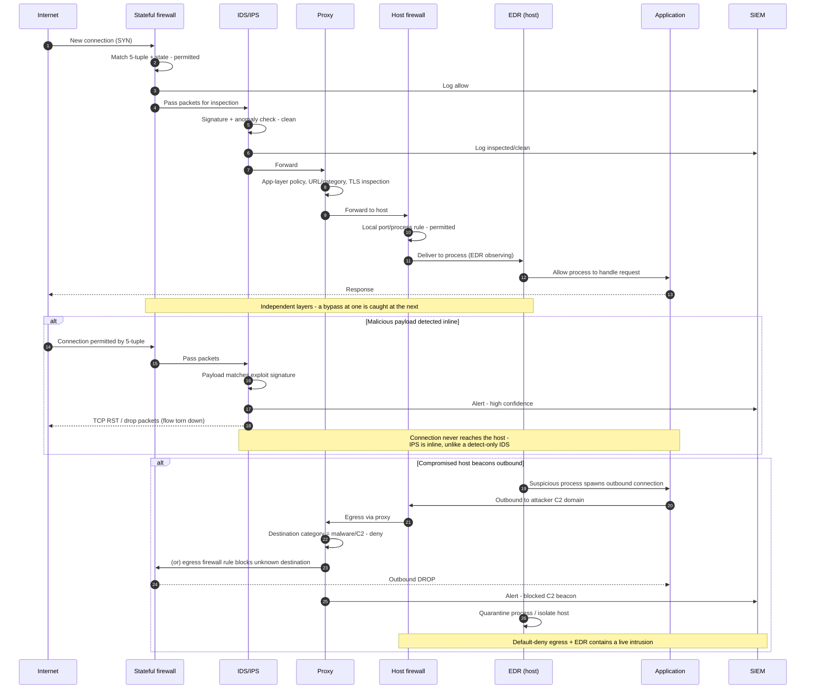

# Defense in Depth — Sequence Diagram

Happy path: an inbound connection is evaluated and logged at each layer, then reaches the
app. Alternates: IPS drops/resets a malicious flow, and egress filtering blocks outbound
C2.

