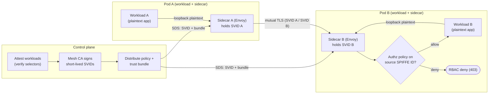

# mTLS in a Service Mesh — Swimlane

Zones are the control plane and two workload pods. Note that each app talks plaintext to
its **local** sidecar; only sidecar-to-sidecar traffic crosses the network, encrypted.

