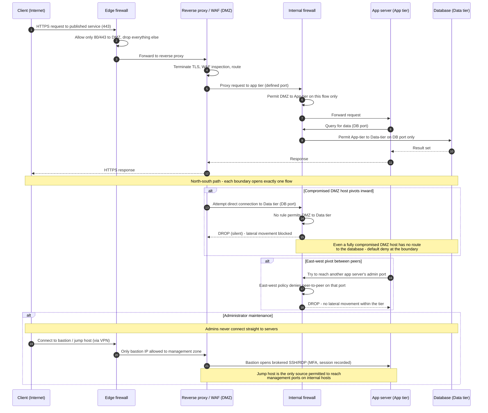

# Network Segmentation and the DMZ — Sequence Diagram

Happy path: a legitimate north-south request traverses the tiers. Alternates: blocked
lateral movement from a compromised DMZ host, and brokered jump-host admin access.

