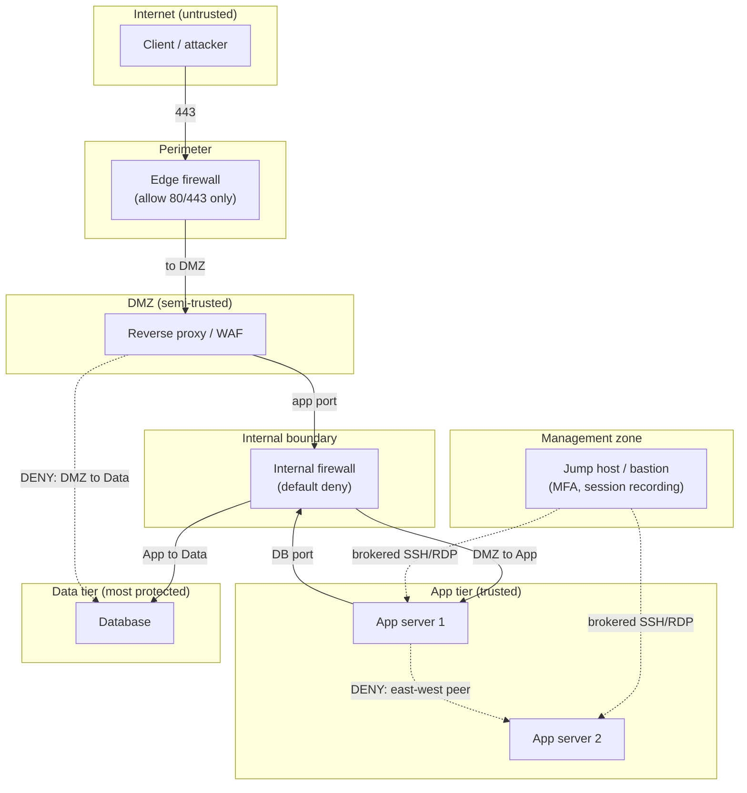

# Network Segmentation and the DMZ — Swimlane

Each subgraph is a **zone**. Solid arrows are allowed flows; the dashed arrows marked
DENY are lateral movements the boundaries drop.

```mermaid
flowchart TD
    subgraph Internet["Internet (untrusted)"]
        CL["Client / attacker"]
    end

    subgraph Perimeter["Perimeter"]
        EF["Edge firewall<br/>(allow 80/443 only)"]
    end

    subgraph DMZ["DMZ (semi-trusted)"]
        RP["Reverse proxy / WAF"]
    end

    subgraph Boundary["Internal boundary"]
        IF["Internal firewall<br/>(default deny)"]
    end

    subgraph AppTier["App tier (trusted)"]
        A1["App server 1"]
        A2["App server 2"]
    end

    subgraph DataTier["Data tier (most protected)"]
        DB["Database"]
    end

    subgraph Mgmt["Management zone"]
        JH["Jump host / bastion<br/>(MFA, session recording)"]
    end

    %% allowed north-south flows
    CL -->|"443"| EF
    EF -->|"to DMZ"| RP
    RP -->|"app port"| IF
    IF -->|"DMZ to App"| A1
    A1 -->|"DB port"| IF
    IF -->|"App to Data"| DB

    %% brokered management access
    JH -.->|"brokered SSH/RDP"| A1
    JH -.->|"brokered SSH/RDP"| A2

    %% denied lateral movement
    RP -.->|"DENY: DMZ to Data"| DB
    A1 -.->|"DENY: east-west peer"| A2
```
