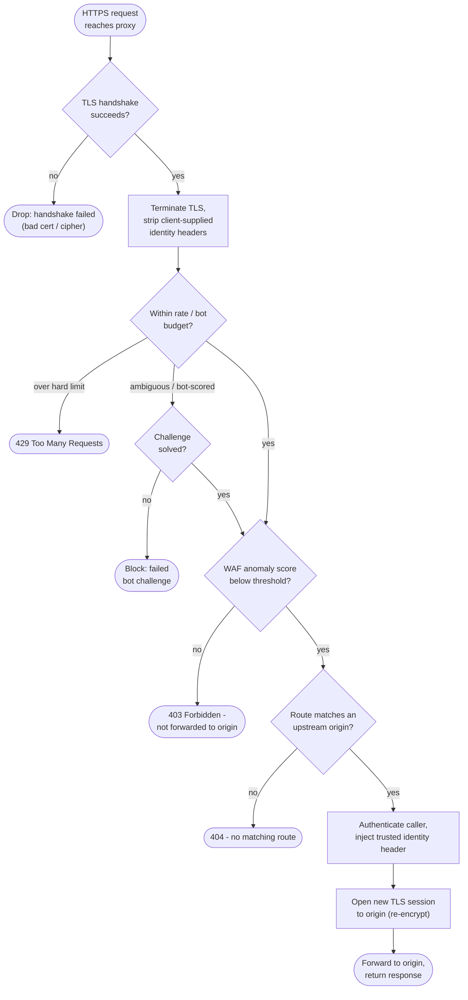

# Reverse Proxy and WAF — Decision Flowchart

Edge evaluation order for an inbound request, from TLS handshake to routing, with
explicit block and challenge terminals.

```mermaid
flowchart TD
    Start(["HTTPS request<br/>reaches proxy"]) --> TLS{"TLS handshake<br/>succeeds?"}
    TLS -->|no| DropT(["Drop: handshake failed<br/>(bad cert / cipher)"])
    TLS -->|yes| Strip["Terminate TLS,<br/>strip client-supplied<br/>identity headers"]

    Strip --> Rate{"Within rate / bot<br/>budget?"}
    Rate -->|"over hard limit"| B429(["429 Too Many Requests"])
    Rate -->|"ambiguous / bot-scored"| Chal{"Challenge<br/>solved?"}
    Chal -->|no| BBot(["Block: failed<br/>bot challenge"])
    Chal -->|yes| Waf
    Rate -->|yes| Waf{"WAF anomaly score<br/>below threshold?"}

    Waf -->|no| B403(["403 Forbidden -<br/>not forwarded to origin"])
    Waf -->|yes| Route{"Route matches an<br/>upstream origin?"}
    Route -->|no| B404(["404 - no matching route"])
    Route -->|yes| Inject["Authenticate caller,<br/>inject trusted identity header"]
    Inject --> Reenc["Open new TLS session<br/>to origin (re-encrypt)"]
    Reenc --> OK(["Forward to origin,<br/>return response"])
```
