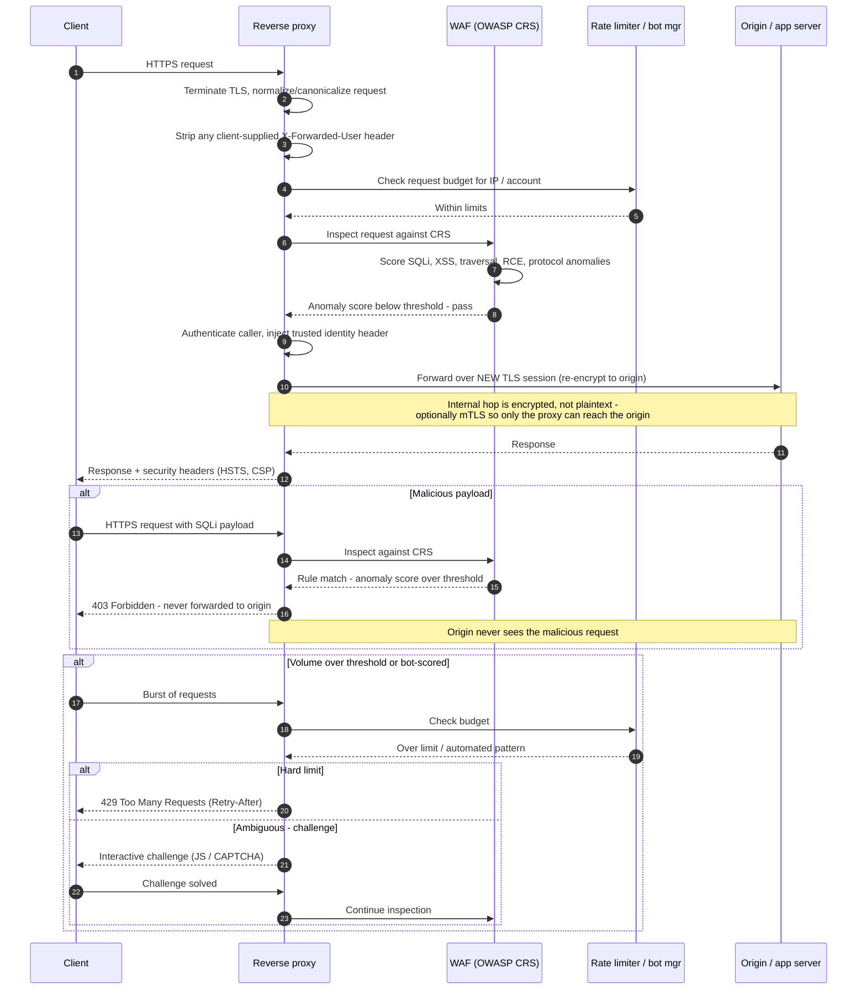

# Reverse Proxy and WAF — Sequence Diagram

Happy path: TLS termination, WAF inspection, rate check, re-encrypted routing to origin,
identity-header injection. Alternates: WAF block, bot / rate-limit challenge.

