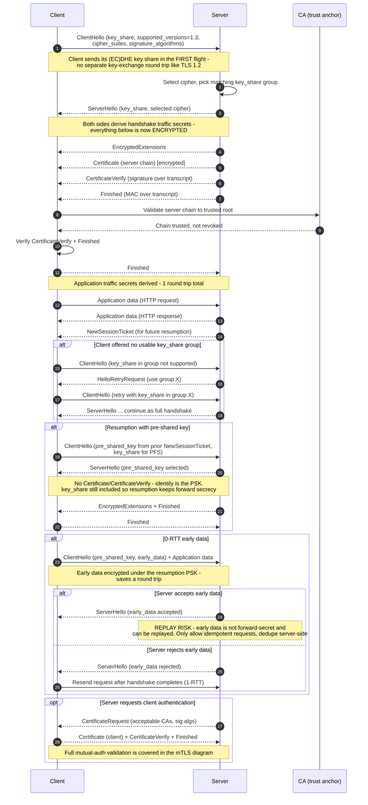

# TLS 1.3 Handshake — Sequence Diagram

Happy path: the 1-RTT full handshake. Alternates: HelloRetryRequest, resumption via
PSK / session ticket, 0-RTT early data (with its replay caveat), and a client-certificate
request.

