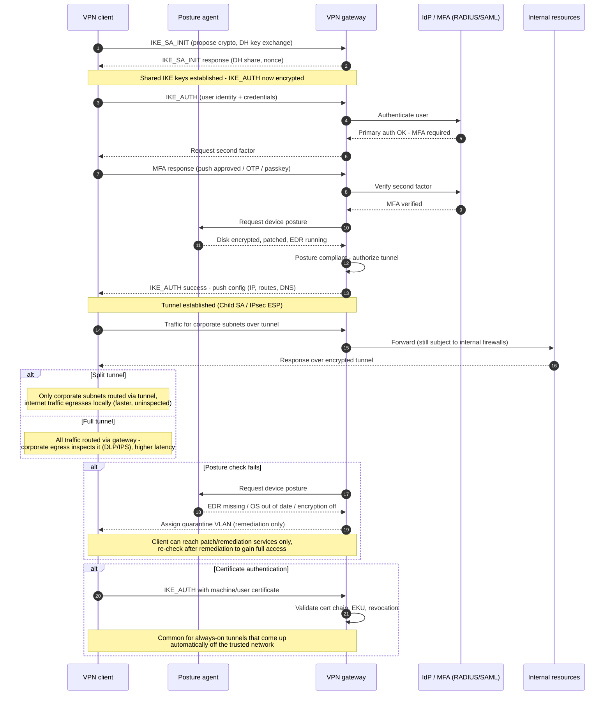

# Remote Access VPN — Sequence Diagram

Happy path: IKEv2/IPsec-style negotiation with MFA and a passing posture check, then
tunnel establishment. Alternates: posture failure to quarantine, certificate auth, and
full vs split tunnel routing.

