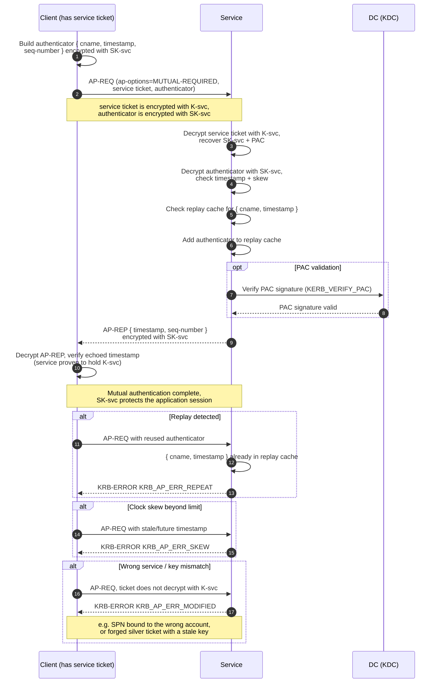

# AP Exchange — Sequence Diagram

Happy path first (mutual auth), then replay, skew, key-mismatch, and optional
PAC-validation variants.

```mermaid
sequenceDiagram
    autonumber
    participant Client as Client (has service ticket)
    participant Svc as Service
    participant DC as DC (KDC)

    Client->>Client: Build authenticator { cname, timestamp,<br/>seq-number } encrypted with SK-svc
    Client->>Svc: AP-REQ (ap-options=MUTUAL-REQUIRED,<br/>service ticket, authenticator)
    Note over Client,Svc: service ticket is encrypted with K-svc,<br/>authenticator is encrypted with SK-svc

    Svc->>Svc: Decrypt service ticket with K-svc,<br/>recover SK-svc + PAC
    Svc->>Svc: Decrypt authenticator with SK-svc,<br/>check timestamp + skew
    Svc->>Svc: Check replay cache for { cname, timestamp }
    Svc->>Svc: Add authenticator to replay cache

    opt PAC validation
        Svc->>DC: Verify PAC signature (KERB_VERIFY_PAC)
        DC-->>Svc: PAC signature valid
    end

    Svc-->>Client: AP-REP { timestamp, seq-number }<br/>encrypted with SK-svc
    Client->>Client: Decrypt AP-REP, verify echoed timestamp<br/>(service proven to hold K-svc)
    Note over Client,Svc: Mutual authentication complete,<br/>SK-svc protects the application session

    alt Replay detected
        Client->>Svc: AP-REQ with reused authenticator
        Svc->>Svc: { cname, timestamp } already in replay cache
        Svc-->>Client: KRB-ERROR KRB_AP_ERR_REPEAT
    end

    alt Clock skew beyond limit
        Client->>Svc: AP-REQ with stale/future timestamp
        Svc-->>Client: KRB-ERROR KRB_AP_ERR_SKEW
    end

    alt Wrong service / key mismatch
        Client->>Svc: AP-REQ, ticket does not decrypt with K-svc
        Svc-->>Client: KRB-ERROR KRB_AP_ERR_MODIFIED
        Note over Client,Svc: e.g. SPN bound to the wrong account,<br/>or forged silver ticket with a stale key
    end
```
