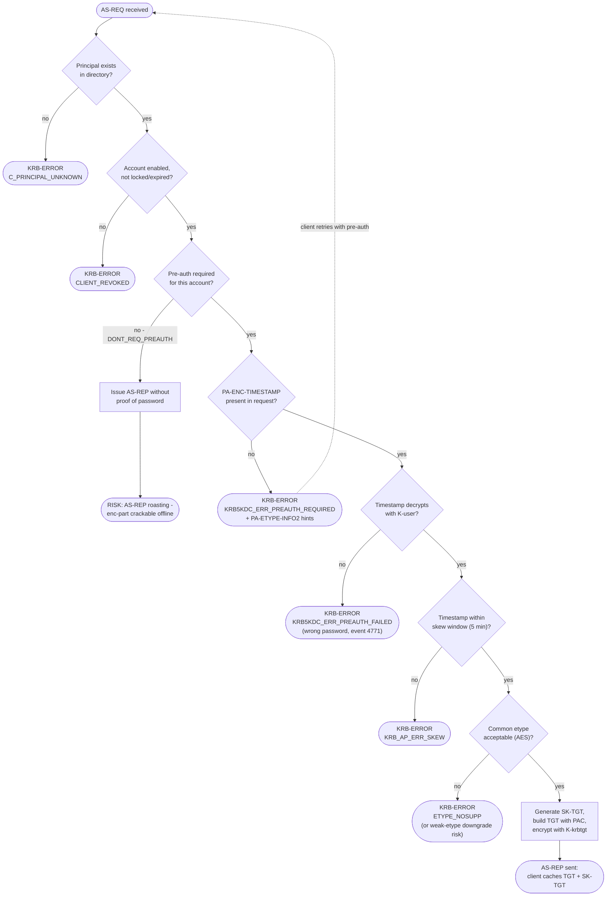

# AS Exchange — Decision Flowchart

KDC-side decision logic for an AS-REQ, with explicit error terminals.

```mermaid
flowchart TD
    START(["AS-REQ received"]) --> P1{"Principal exists<br/>in directory?"}
    P1 -->|"no"| E1(["KRB-ERROR<br/>C_PRINCIPAL_UNKNOWN"])
    P1 -->|"yes"| P2{"Account enabled,<br/>not locked/expired?"}
    P2 -->|"no"| E2(["KRB-ERROR<br/>CLIENT_REVOKED"])
    P2 -->|"yes"| P3{"Pre-auth required<br/>for this account?"}

    P3 -->|"no - DONT_REQ_PREAUTH"| W1["Issue AS-REP without<br/>proof of password"]
    W1 --> RISK(["RISK: AS-REP roasting -<br/>enc-part crackable offline"])

    P3 -->|"yes"| P4{"PA-ENC-TIMESTAMP<br/>present in request?"}
    P4 -->|"no"| E3(["KRB-ERROR<br/>KRB5KDC_ERR_PREAUTH_REQUIRED<br/>+ PA-ETYPE-INFO2 hints"])
    E3 -.->|"client retries with pre-auth"| START

    P4 -->|"yes"| P5{"Timestamp decrypts<br/>with K-user?"}
    P5 -->|"no"| E4(["KRB-ERROR<br/>KRB5KDC_ERR_PREAUTH_FAILED<br/>(wrong password, event 4771)"])
    P5 -->|"yes"| P6{"Timestamp within<br/>skew window (5 min)?"}
    P6 -->|"no"| E5(["KRB-ERROR<br/>KRB_AP_ERR_SKEW"])
    P6 -->|"yes"| P7{"Common etype<br/>acceptable (AES)?"}
    P7 -->|"no"| E6(["KRB-ERROR<br/>ETYPE_NOSUPP<br/>(or weak-etype downgrade risk)"])
    P7 -->|"yes"| OK["Generate SK-TGT,<br/>build TGT with PAC,<br/>encrypt with K-krbtgt"]
    OK --> DONE(["AS-REP sent:<br/>client caches TGT + SK-TGT"])
```
